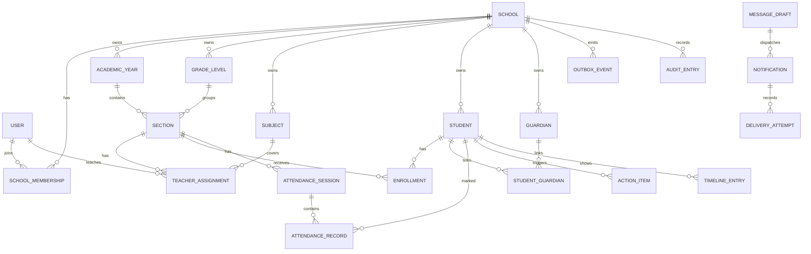

# SchoolOS Domain Model

## Ownership

`School` owns v1 operational data. Users can belong to multiple schools through `SchoolMembership`, but every school-scoped request must choose and authorize an active school context.

Historical academic records should be preserved. Prefer deactivation or end dates over deletion once a record has academic history.

## Entity Overview

## Core Entities

### Identity

- `User`: login identity with email, password hash, status, and timestamps.
- `Session`: revocable login session stored in a secure HttpOnly cookie.
- `SchoolMembership`: user, school, role, and status. Unique per user and school.

### Schools And Academics

- `School`: name, timezone, language, working days, and attendance policy defaults.
- `AcademicYear`: school-owned date range. Dates must be valid and non-inverted.
- `GradeLevel`: school-owned label and sort order.
- `Section`: academic year and grade level grouping. Labels are unique within the school, academic year, and grade level context.
- `Subject`: school-owned subject catalog entry.
- `TeacherAssignment`: assigns a teacher to a section and optionally a subject.

### Students And Guardians

- `Student`: school-scoped student record with unique student number and lifecycle status.
- `Guardian`: school-owned contact identity for a parent or guardian.
- `StudentGuardian`: many-to-many link with relationship type, portal access flag, notification permission, and emergency contact flag.
- `Enrollment`: student, section, start date, optional end date, and status. Past enrollments are retained.

### Attendance

- `AttendanceSession`: section, school-local date, draft/final state, finalized metadata, and unique daily constraint.
- `AttendanceRecord`: one per student per session. Holds marked state, notes, timestamps, correction metadata, and actor references.
- `AttendancePolicy`: threshold and window for the repeated-absence rule.

### Actions And Timeline

- `ActionItem`: reason, student, rule key, evidence, assignee, status, and resolution metadata.
- `TimelineEntry`: student-facing event reference with visibility, timestamp, title, summary, and source object.

### Communication And Delivery

- `MessageDraft`: recipient, channel, content, author, revision, approval status, and approval metadata.
- `Notification`: requested delivery for an approved draft and exact revision.
- `DeliveryAttempt`: attempt status, timestamps, provider reference when available, and error details safe for logs.
- `OutboxEvent`: durable event envelope with retry and lease state.

### Audit

- `AuditEntry`: actor, operation, target type, target id, school, redacted changes, timestamp, and request metadata.

## Tenant Safety Constraints

Database and application rules should prevent cross-school references:

- Child records include `school_id` where they are queried or authorized by tenant.
- Foreign keys should reference parents in the same school where the database can enforce it.
- Application services must verify tenant access before loading or mutating resources.
- Background jobs and integrations must also operate within explicit school scope.

Important unique constraints:

- One membership per user and school.
- One student number per school.
- One section label per school, academic year, and grade level.
- One attendance session per section and local date.
- One attendance record per session and student.
- One open repeated-absence action per student, rule key, and school.
- One notification dispatch per approved draft revision and recipient.

## Attendance Semantics

Daily attendance belongs to a school-local date. Instants are stored in UTC, but attendance windows and school days are evaluated in the school's timezone.

Roster derivation:

1. Select enrollments where `start_date <= session_date`.
2. Exclude enrollments with `end_date < session_date`.
3. Include only students active for that school.

Draft save:

- May create or update records.
- May leave some students unmarked.
- Does not trigger absence rules, guardian messages, or delivery work.

Finalization:

- Validates the actor can finalize for the section.
- Stores attendance and the domain event in one database transaction.
- Is idempotent: duplicate finalize requests must not duplicate events or actions.
- Evaluates repeated-absence rules only for marked records.

Corrections:

- Require actor, reason, old value, and new value.
- Write an audit entry.
- Recompute repeated-absence evidence.
- Preserve historical timeline context instead of silently erasing history.

Summaries:

- Exclude unmarked records from percentage denominators.
- State the denominator clearly.
- Do not show a percentage when there are no marked records.
- Treat `LATE` and `EXCUSED` separately from unexcused `ABSENT`.

## Action Lifecycle

Statuses:

- `OPEN`
- `IN_PROGRESS`
- `RESOLVED`
- `DISMISSED`

A repeated-absence action should include evidence dates, attendance record references, rule settings used, and a human-readable explanation. Duplicate event processing must update the existing open action instead of creating another one.

Resolving an action closes that evidence set. New qualifying evidence after resolution may create a new action.

## Timeline Visibility

Suggested visibility values:

- `INTERNAL`: admins and authorized staff only.
- `STAFF`: admins and assigned teachers.
- `GUARDIAN`: guardians linked to the student with portal access.

Guardian-visible entries must not leak internal notes, audit details, disciplinary speculation, or unrelated students.

## API Contract Sketch

Contracts will be refined before each implementation milestone. Initial route groups:

- `/api/v1/auth/*`: onboarding, login, logout, session.
- `/api/v1/schools/*`: school settings and membership context.
- `/api/v1/academics/*`: years, levels, sections, subjects, assignments.
- `/api/v1/students/*`: directory, guardians, enrollments, profile.
- `/api/v1/attendance/*`: sessions, records, finalization, corrections, summaries.
- `/api/v1/actions/*`: inbox, assignment, status changes, resolution.
- `/api/v1/timeline/*`: student timeline with role-aware filtering.
- `/api/v1/communication/*`: drafts, approvals, notifications, delivery status.
- `/api/v1/integrations/n8n/*`: narrow authenticated workflow endpoints.

